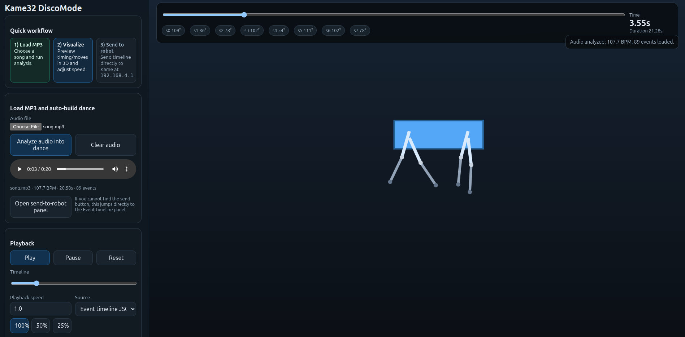

# Kame32 DanceMode (Flask Preview + Audio-to-Events)

A Flask web app for building and previewing Kame32 dance timelines, then optionally streaming them to a robot over the stock Wi-Fi HTTP API.



## What this app does

- 3D (or fallback 2D) movement preview in the browser (local static Three.js preferred; CDN fallback)
- Multiple preview modes:
  - live joystick gait
  - button routine approximations
  - manual 8-servo pose
  - event timeline JSON
  - keyframe JSON
- Audio upload (`.mp3`, `.wav`, `.ogg`, `.m4a`, `.flac`) and automatic dance-event generation using `librosa`
- Browser audio synchronization so motion follows the media clock
- Playback speed controls (`100%`, `50%`, `25%`, plus numeric custom speed)
- Send timeline directly to robot via:
  - `GET /joystick?x=...&y=...`
  - `GET /button?label=...`
- Dry-run send validation and send-speed throttling (`0.25` to `1.0`)

## Quick start

```bash
python -m venv .venv
source .venv/bin/activate
pip install -r requirements.txt
python app.py
```

Open: <http://127.0.0.1:5000>

### Log verbosity

Use `KAME32_LOG_LEVEL` to control Flask app logging without code changes:

```bash
KAME32_LOG_LEVEL=DEBUG python app.py
```

Accepted values include standard logging names (`DEBUG`, `INFO`, `WARNING`, etc.) or numeric levels.

## Primary workflow

1. **Load MP3/audio** in the left panel.
2. Click **Analyze audio into dance**.
3. Inspect/edit generated **Event timeline JSON**.
4. Preview with **Play** and optional slower playback.
5. Optionally send to hardware with **Send timeline to robot**.

## API summary

### `POST /api/analyze-audio`

`multipart/form-data` with field name `audio`.

Success response includes:

- `filename`
- `tempo`
- `duration`
- `events`
- `event_count`

Common error codes:

- `missing_audio`
- `missing_filename`
- `unsupported_audio_format`
- `audio_analysis_failed`
- `upload_too_large`

### `POST /api/send-to-robot`

Example request:

```json
{
  "base_url": "http://192.168.4.1",
  "events": [
    {"t": 0.0, "kind": "button", "payload": "Start"},
    {"t": 0.2, "kind": "joystick", "payload": [0, 70]},
    {"t": 1.2, "kind": "joystick", "payload": [0, 0]},
    {"t": 1.3, "kind": "button", "payload": "Stop"}
  ],
  "send_speed": 0.5,
  "dry_run": false
}
```

Validation/limits:

- events required, non-empty, sorted by `t`
- max events: `5000`
- max timeline timestamp: `600s`
- supported kinds: `button`, `joystick`
- allowed button labels: `A B C X Y Z Start Stop`
- `send_speed` range: `0.25..1.0`

Behavior:

- Missing Start/Stop/early-neutral joystick are auto-added as safety bookends.
- `dry_run=true` validates and returns metadata without network dispatch.
- Non-dry-run dispatch runs on a worker thread with timeout and clear network error reporting.


## 3D without browser setting changes (install locally)

The app now tries **local static Three.js modules first**, then CDNs (`jsDelivr`, `unpkg`) as fallback.

If your environment blocks CDNs, vendor modules locally once:

```bash
./scripts/install_three_local.sh
```

This script installs `three@0.164.1` via npm in a temp directory and copies only:
- `three.module.js`
- `OrbitControls.js`

During install, it also rewrites `OrbitControls.js` to import the local `three.module.js` path (instead of bare specifier `three`), so browser import-map settings are not required.

into:
- `static/vendor/three/build/three.module.js`
- `static/vendor/three/examples/jsm/controls/OrbitControls.js`

Then restart Flask and reload the page.

If local files are missing and CDNs are blocked, the app degrades to 2D preview mode.

If you still see `3D module failed to load (local/CDN unavailable)` after vendoring, hard-refresh once to clear any cached failed module imports.

## Tests

```bash
python -m unittest -v tests/test_audio_analysis.py
```

## Notes

- This project is a practical preview/scripting tool, not an exact physical digital twin.
- Button routine animations are approximations of style/timing.
- Audio analysis generates event timelines (buttons + joystick moves), not IK-optimized choreography.
